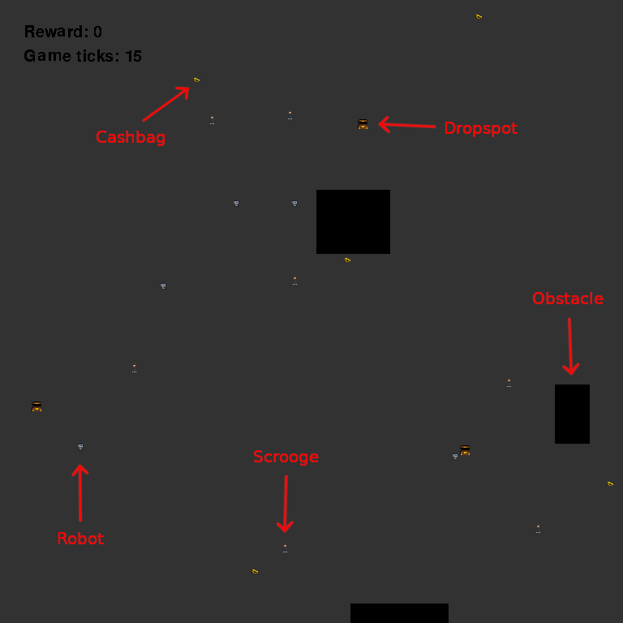

# Robot Robbers - Winning Solution for DM in AI 2022

## 📝 Description

This project contains my team's winning solution for one of the three challenges of the Danish Championship in AI 2022. The challenge was to maximize your score playing 2 wall-clock minutes of the game *Robot Robbers*.

*Robot Robbers* is an interactive 2D game where you, the player, control 5 robots trying to steal money from angry scrooges. When a robot robber intersects with a cashbag, the robot picks it up. When a robot carrying cashbags intersects with a dropspot, the cashbags are deposited and a reward is provided. The scrooges are the game antagonists. They will try their very best to keep the cashbags from being stolen. If a robot carrying cashbags intersects with a scrooge, the cashbags are taken away and the player receives a penalty.

## 🕹️ Gameplay

## 🏄‍♂️ Usage

The command `make ai && python3 main.py` will compile the C-code and run a visualization of the solution on a random seed.
